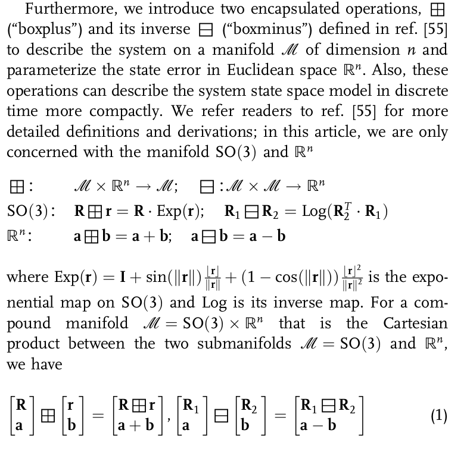
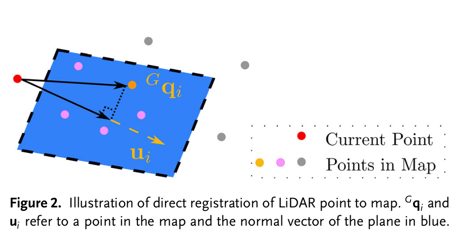
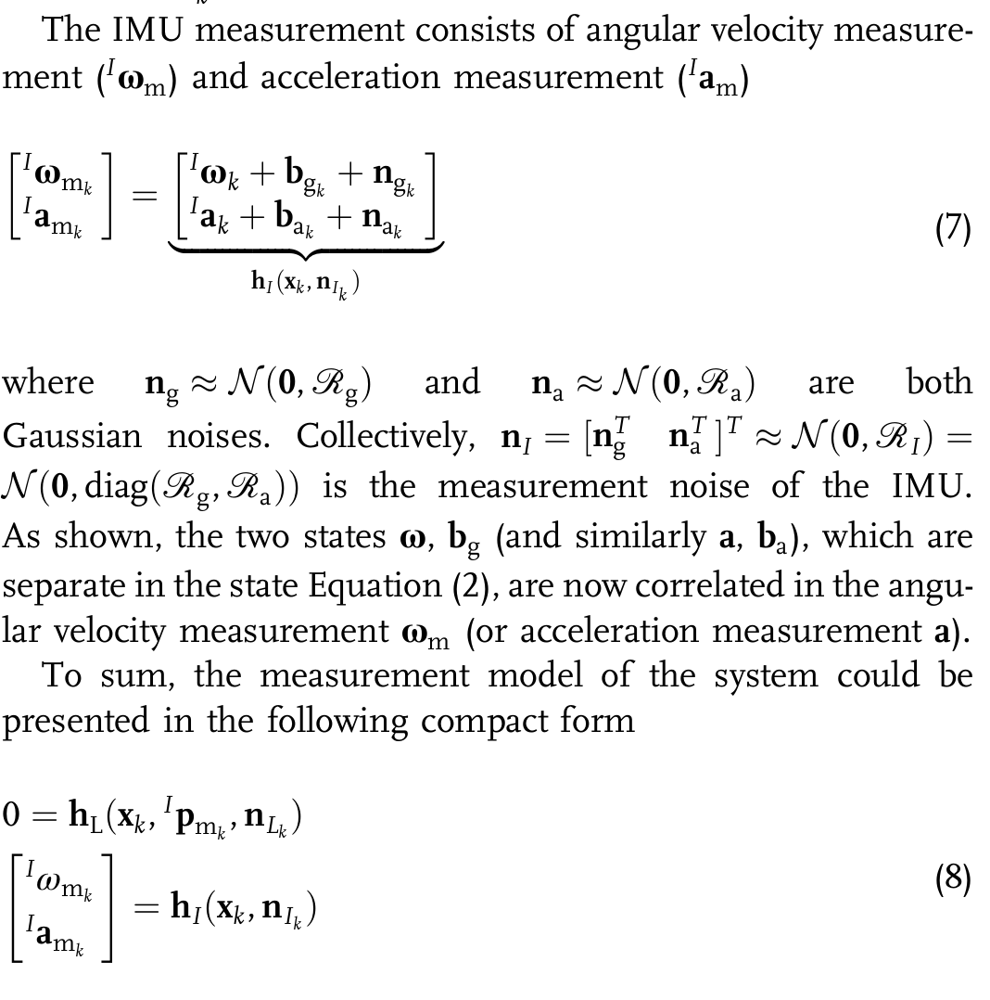
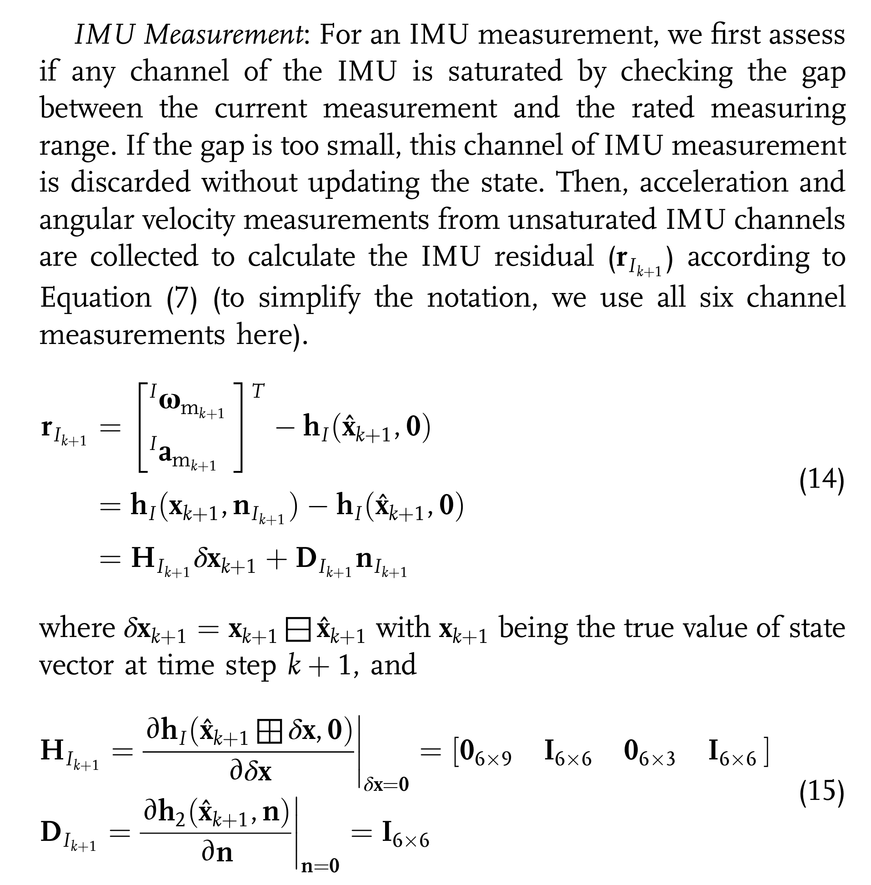
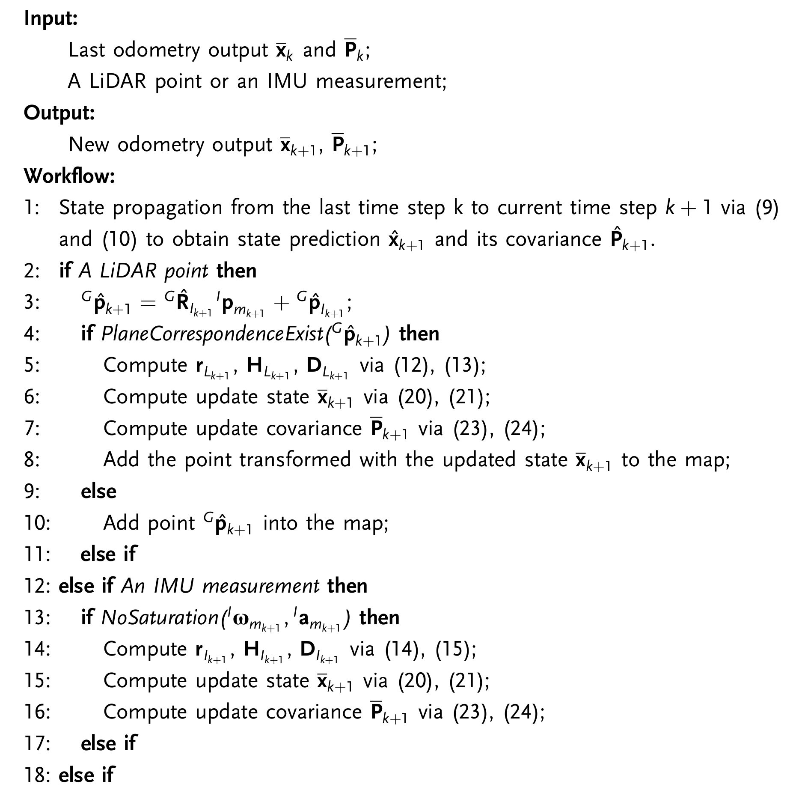

# Batch-LIWO复刻项目

尝试根据公开信息复刻中科大RoboWalker战队2025赛季未开源的Batch-LIWO里程计。

本项目Fork自point_lio_ros2，感谢point_lio原作者和ros2移植开发者的贡献，以及中科大的开源。

## 资料汇总

1.论坛开源提供的技术报告和Batch-LIWO论文：https://bbs.robomaster.com/article/803727

2.RMUC2025青工会技术分享：https://www.bilibili.com/video/BV1E44RzqEoy

3.Point-LIO原始论文

## 原理分析

截至目前（2025/12/2），中科大25赛季哨兵导航仍然没有任何一项技术的代码仓库有开源更新，所以只能从point_lio开始自己手搓。

由于要给原项目动手术，我们先从Point-LIO原项目的原理和整体工程组织开始，**先给一个非常意识流的总体描述**

Point-LIO的主要创新点在于Point Wise更新。相比其他LIO的逐帧更新（10Hz左右），一方面能够避免帧内运动畸变，另一方面极大提高输出带宽（200000Hz）。提高了鲁棒性，能够应对哨兵被撞等速度突变。

同时，Point-LIO相比FAST-LIO等传统方法，加入了状态量扩充。也就是，之前的Kalman滤波状态量只有位置、速度、姿态等，IMU读出的角速度、加速度等直接当成input，如果出现IMU爆量程（动的太快，即所谓saturation）等现象就会导致观测异常。Point-LIO在状态量中直接加入了角速度和加速度，如果IMU数据异常就降低置信度，用lidar的点云数据估计角速度和加速度，一定程度上提高了稳定性。而且因为采用逐点更新，lidar更新频率远超IMU，这种方法就可以在IMU没数据的时候用lidar数据估计相关运动学状态。

**然后仔细分析一下整个算法流程。**

Point-LIO（和所有基于滤波的slam）的算法核心在于两个步骤（其实就是Kalman滤波的两个步骤），预测和修正。用IMU获取运动学数据（角速度、加速度），预测下一刻的位姿，然后用lidar点计算残差、修正位置和协方差矩阵。这里就引出了point-lio和fast-lio等传统的（此处指frame wise的）slam的主要区别。传统的slam获取点云的途径是整帧获取，假设雷达坐标系在获取整帧的一个极短时间片内基本匀速运动，然后根据每个点云的时间戳，用imu获取的位姿数据修正帧内运动畸变，把所有点的位姿全部变换到同一个时间戳下，这种方式的缺点主要在于如果车被撞了点云就乱了，而且雷达装底盘上就没法小陀螺，因为动的太快导致没法修正运动畸变。point-lio直接采用单个点数据来修正状态量估计结果，这样就直接消灭了帧内运动畸变的问题，因为连帧都没了。同时，由于这个改动，相当于imu更新频率（200Hz+）远远落后于lidar点更新速率（200000Hz+），差距达到了1000倍，这种情况下仍然使用原先的方法肯定是不行的。为此point-lio在状态量中直接加入了角速度和加速度（本来要从imu拿到的数据），在没有imu数据到来的时候，直接用上一刻的角速度和加速度估计下一刻的运动状态（低置信度），并用lidar点修正防止运动状态突变或估计发散，在有imu数据到来的时候，就用imu数据直接更新运动状态（高置信度）。

借助这种机制，point_lio同时具备了“高带宽”和“高鲁棒”两种特性，比如现在车被撞了一下，传统lio必须等到下一帧imu数据到了，才知道加速度变了，但是point-lio通过带宽极高的lidar点修正，就能够瞬间感知到运动状态的变化。

**下面理一下整体的公式推导**。先说记号

Point-LIO的状态向量是一个$`SO(3)\times \mathbb{R}^{21}`$流形上的24维向量，如下：

$$
\boldsymbol x=[^GR_I,\,^Gp_I,\,^Gv_I,\,b_g,\,b_a,\,^I\omega,\,^Ia]
$$

其中：

$^GR_I$是IMU坐标系到世界坐标系的旋转矩阵（姿态）

$^Gp_I$是IMU坐标系在世界坐标系的位置

$^Gv_I$是IMU坐标系在世界坐标系的线速度

$^I\omega$和$^Ia$分别为IMU坐标系的角速度和加速度

$b_g$和$b_a$分别为陀螺仪零偏和加速度计零偏。

$^Gg$为世界坐标系下的重力向量。

同时，针对$x$本身有不同的标记

${x}$是状态向量的真实值，就是真实世界中的值，我们最终要估计的对象

$x_k$是第$k$次测量得到的$x$测量值

$\hat{x}$是预测值，$\overline x$是更新值

$\delta x$是误差，就是真实值和估计值中间的差值

有了这些记号，就可以开始推导。

首先推状态转移模型，在推出具体的计算公式（即离散时间模型）之前，我们先要找出连续时间下的运动学模型。Point-LIO的选择是直接用积分的方法把各种量积出来（机器人运动具有一定程度的连续性，因此积分足够用），并且认为随机游走IMU零偏（$`b_g`$和$`b_a`$）服从高斯分布$`n_{b_g}`$和$`n_{b_a}`$，并且方差分别为$`Q_{b_g}`$和$`Q_{b_a}`$。将 IMU 坐标系（记为 $`I`$）作为机体坐标系，并将第一帧 IMU 坐标系作为全局坐标系（记为 $`G`$），连续运动学模型如下，即为论文中(2)式：

$$
\begin{aligned}
{}^G\dot{\mathbf{R}}_I &= {}^G\mathbf{R}_I \lfloor {}^I\boldsymbol{\omega} \rfloor, & {}^G\dot{\mathbf{p}}_I &= {}^G\mathbf{v}_I, & {}^G\dot{\mathbf{v}}_I &= {}^G\mathbf{R}_I {}^I\mathbf{a} + {}^G\mathbf{g}, & {}^G\dot{\mathbf{g}} &= \mathbf{0} \\
\dot{\mathbf{b}}_g &= \mathbf{n}_{b_g}, & \dot{\mathbf{b}}_a &= \mathbf{n}_{b_a}, & {}^I\dot{\boldsymbol{\omega}} &= \mathbf{w}_g, & {}^I\dot{\mathbf{a}} &= \mathbf{w}_a
\end{aligned} \quad (2)
$$

下面尝试对(2)式离散化。由于Point-LIO所处理的状态空间并不是一个纯粹的欧氏空间，而是包括了平移和旋转两个子流形，即上面说的$`SO(3)\times \mathbb{R}^{21}`$流形，其中前面的旋转矩阵代表SO(3)的子流形（即特殊正交群，三个自由度，代表三维空间中所有可能的旋转操作），需要用Lie群的指数映射（即Rodrigues公式）处理，后面的21维线性空间包括了位置、角速度、加速度等，属于欧氏空间，只要用普通的线性代数的方法就能处理（中间那个乘号是Descartes积）。为了方便处理，定义两个记号boxplus和boxminus（流形上的广义加减法），具体运算如下：

由此，我们可以通过这两个记号直接操作状态空间，而不用分开分别处理平移运动和旋转运动。根据上面的连续时间运动学模型，我们可以直接将其写成状态空间的形式，也就是

$$
x_{k+1}=x_k\boxplus(\Delta t_kf(x_k,w_k))
$$

这个式子就是**状态转移模型**。其中误差状态函数$`f`$以及过程噪声 $`\mathbf{w}`$ 定义如下：

$$
\begin{aligned}
\mathbf{w} &\triangleq [\mathbf{n}_{b_g} \quad \mathbf{n}_{b_a} \quad \mathbf{w}_g \quad \mathbf{w}_a] \approx \mathcal{N}(\mathbf{0}, \mathcal{Q}) \\
\mathbf{f}(\mathbf{x}, \mathbf{w}) &\triangleq [{}^I\omega \quad {}^G\mathbf{v}_I \quad {}^G\mathbf{R}_I {}^I\mathbf{a} + {}^G\mathbf{g} \quad \mathbf{n}_{b_g} \quad \mathbf{n}_{b_a} \quad \mathbf{0}_{3\times1} \quad \mathbf{w}_g \quad \mathbf{w}_a] \in \mathbb{R}^{24}
\end{aligned} \quad (4)
$$

其中 $`\mathcal{Q} = \text{diag}(\mathcal{Q}_{b_g}, \mathcal{Q}_{b_a}, \mathcal{Q}_g, \mathcal{Q}_a)`$ 是过程噪声 $`\mathbf{w}`$ 的协方差矩阵。

接下来再来推导测量模型（measurement model），就是测量值、真实值和噪声值之间的关系。我们的测量值分成IMU measurements和LiDAR Point两种，下面先讲lidar

首先明确一下怎么衡量一个lidar点的误差，我们没有直接衡量的手段，但是可以选择相信之前的点。一个lidar点如果是可信的，它一定处在某个平面上，无论这个平面多么小（因为真实世界中很少有单独挂在空中的微小物体），也就是，我们可以将它周围的点拟合出一个平面，计算这个lidar点到该平面的距离，作为误差，更准确的说是残差（residual），如下图

根据以上分析，我们可以得出对lidar点的处理逻辑。首先是建模，我们将单个lidar点建模为真实位置+噪声的形式，并将所有噪声都视为guassian noise，即为

$$
^Ip_{m_k}=^Ip_k^{gt}+n_{L_k}
$$

其中左上角标$I$表示是在IMU坐标系下，$`^Ip_{m_k}`$表示第$k$个lidar点的位置，$`^Ip_k^{gt}`$表示该点真实位置，最后面那个就是噪声。然后就是所谓“**隐式测量模型**”，也就是在理想情况下，测量点需要满足的一个式子

$$
0=^Gu_k^T(^GT_{I_k}(^Ip_{m_k}-n_{L_k})-^Gq_k)
$$

其中，$`^GT_{I_k}`$是从世界坐标系变换到IMU坐标系的齐次变换矩阵，$`^Gq_k`$是拟合出平面上的任意一点。要求这个式子（其实说了半天本质上就是个平面距离公式）为0，就相当于要求（变换到世界坐标系下的）测量点必须在平面上。后面这个式子记为$`h_L(x_k,^Ip_{m_k},n_{L_k})`$，然后就是IMU测量模型，这个没有太复杂的公式，基本上仍然是真实值+噪声的逻辑，直接贴原文

到这里，建模部分基本完成，状态转移模型和测量模型都已经明确，下一步开始进行滤波器设计。point_lio的滤波器是“紧耦合（tight coupled）Kalman滤波”，意味着lidar点和imu数据修改同一个状态向量。状态传播模型

$$
\hat x_{k+1}=\overline x_k\boxplus(\Delta t_kf(\overline x_k,w_k))
$$

是好理解的，跟上面一样，但是协方差传播模型$`P_{k+1}=F_{x_k}P_kF_x^T+F_{w_k}Q_kF_{w_k}^T`$没给推导，下面主要理一下协方差怎么从k时刻传播到k+1时刻，由于协方差矩阵的定义是误差的期望，首先看误差状态$`\delta x_{k+1}=f(x_k,w_k)`$的定义。

由于上面的$`f(x_k,w_k)`$描述了一个非线性系统，无法像线性系统一样直接计算协方差矩阵，需要线性化。进行一阶泰勒展开得到

$$
\delta x_{k+1}=F_{x_k}\delta x_k+F_{w_k}w_k
$$

其中$`F_{x_k}=\frac{\partial \delta x_{k+1}}{\partial \delta x_{k}}`$是误差状态转移矩阵（上一刻的误差传递到当前时刻），$`F_{w_k}=\frac{\partial \delta w_{k+1}}{\partial \delta w_k}`$是噪声Jacobi矩阵（IMU噪声对状态的影响）

协方差矩阵的定义是误差的期望，也就是

$$
P_{k+1}=E[\delta x_{k+1}\delta x_{k+1}^T]=E[(F_x\delta x_k+F_{w_k}w_k)(F_x\delta x_k+F_{w_k}w_k)^T]=F_{x_k}P_kF_x^T+F_{w_k}Q_kF_{w_k}^T
$$

其中Q_k是过程噪声协方差。两个F矩阵具体如何计算论文中已经给出。

得出上述传播模型之后，下一步进入残差计算，也就是对于lidar点和imu数据，分别如何具体计算误差和协方差。测量模型定义了点云应该满足的几何约束（即点在平面上），而残差计算则是将当前预测的状态代入该模型，量化了当前预测值偏离这一几何约束的程度（即点到平面的实际距离），这个距离将被用于修正系统的状态。

对于lidar点，残差基本可以直接按照测量模型来计算，也就是

$$
r_{L_{k+1}}=0-h_L(\hat x_{k+1},^Ip_{m_{k+1}}, 0)
$$

此外还涉及到观测矩阵线性化的问题。

为了使用扩展卡尔曼滤波（EKF）更新状态，我们需要知道这个残差相对于误差状态$`\delta x`$是如何变化的，也就是求雅可比矩阵$`H_{L_{k+1}}`$

我们将非线性的观测函数$`h_L`$在预测状态处进行一阶泰勒展开

$$
r_{L_{k+1}}=H_{L_{k+1}}\delta x_{k+1}+D_{L_{k+1}}n_{L_{k+1}}
$$

其中H_L矩阵和D_L矩阵通过求导计算得出，论文中已经给出计算过程。

对于imu数据，可得类似结论，逻辑是一样的，这里直接贴原文

至此还剩最后一步，就是状态更新。

这一步的核心逻辑其实非常直观：预测值（Prior）觉得我在A，测量值（Measurement，即雷达观测）觉得我在B，滤波器要做就是根据两者各自的“靠谱程度”（也就是协方差），加权融合出一个后验估计（Posterior）。

但这里有一个关键点：**Point-LIO使用的是IESKF（Iterated ESKF，迭代误差状态卡尔曼滤波）**。为什么要“迭代”？因为前面找“最近邻平面”这一步，是依赖于我们当前估计的位置的。如果估计的位置变了，找到的最近点可能就变了，拟合出的平面法向量$`u`$也会变，导致观测矩阵$`H`$也会变。这是一个典型的非线性问题。所以，不能像普通KF那样算完拉倒，而是要在一个时间步内多算几次（Point-LIO默认好像是迭代2次或者直到收敛）。

具体流程如下：

计算卡尔曼增益

$$
\mathbf{K} = \mathbf{P} \mathbf{H}^T (\mathbf{H} \mathbf{P} \mathbf{H}^T + \mathbf{R})^{-1}
$$

然后更新误差状态。有了增益$`K`$和残差$`r`$，就能算出我们这次应该把状态往回拉多少：

$$
\delta \mathbf{x} = \mathbf{K} \mathbf{r}
$$

注意，算出来的这个$`\delta \mathbf{x}`$是误差状态，是在切空间（tangent space）里的。

再把算出来的“误差”补偿回“名义状态”上。因为有旋转矩阵的存在，不能直接加减，得用我们前面定义的boxplus操作：

$$
x_{k+1}^{updated} = x_{k+1}^{predicted} \boxplus \delta \mathbf{x}
$$

更新完一次状态后，我们用这个新的$`x_{k+1}^{updated}`$作为新的线性化点，重新去地图里找最近点、重新算残差、重新算雅可比，看看能不能让结果更收敛。

更新协方差（Update Covariance）：等迭代结束（收敛了），状态修正准了，把协方差矩阵$`P`$也更新一下。因为融合了雷达观测，系统的不确定性下降了，$`P`$矩阵会变小：

$$
\mathbf{P}^{updated} = (\mathbf{I} - \mathbf{K} \mathbf{H}) \mathbf{P}
$$

最后，把这个经过层层修正、已经非常“准”的当前点，插入到ikd-Tree中。
这一步非常关键，因为**现在的观测点，就是下一时刻的地图**。Point-LIO之所以快，就是因为ikd-Tree支持增量式更新（动态平衡二叉树），不需要像传统方法那样重构整个地图。

这一套下来，就实现了在算力有限的平台上（比如无人机机载电脑），既能跑得飞快（高带宽），又能抗住剧烈运动（高鲁棒）的效果。最后回顾一下论文里最后提供的伪代码流程，总览一下整个流程

batch-liwo在point_lio的基础上开发，主要3个创新点，

1.将逐点更新改为批量（Batch）更新

2.在Point-LIO的基础上融合轮速数据

3.（在电控层实现的）线性Kalman底盘速度观测器

## 进度更新

2025/12/3

1.fork point_lio_ros2项目，准备开始开发

2.原项目没有完整支持MID360，重写了preprocess.cpp中部分内容，支持获取MID360提供的标准PointCloud2点云

目前已经能够跑通原项目，定位等功能均正常，实测平均CPU占用率（仅运行Point-LIO）在30%上下，偶尔有一两个核会飘到50%以上

2025/12/4

1.完整读了一遍Point-LIO原论文，跟着推了一遍公式，更新了一些原理分析

2025/12/9

中间停了3天，今天继续。

1.公式推导和原理分析初步总结完毕
